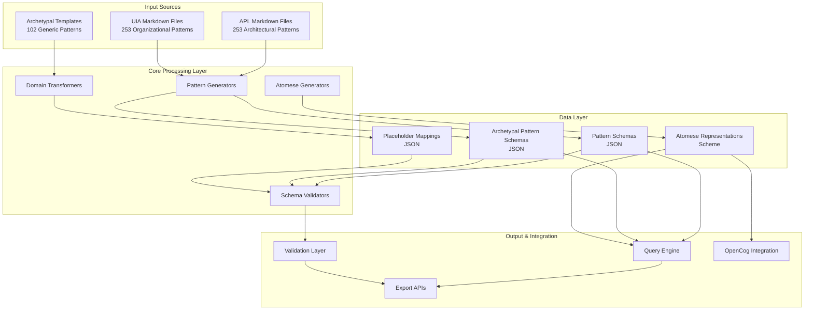
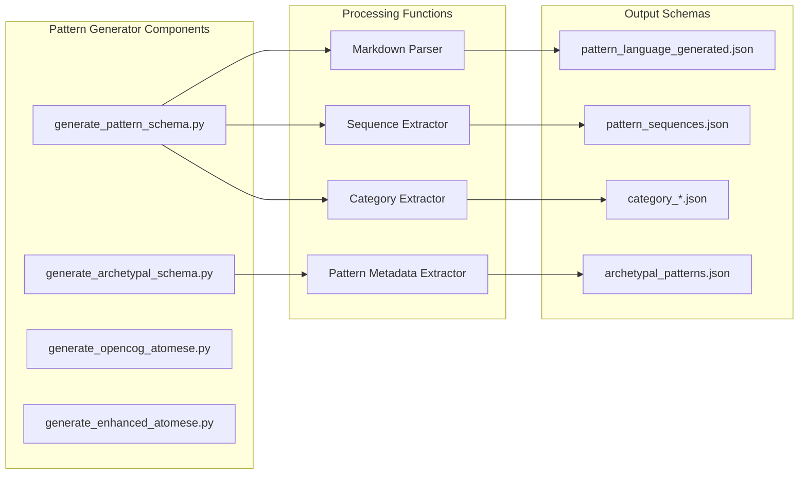

# Pattern Language System - Architecture Overview

## Executive Summary

This system implements a comprehensive Pattern Language architecture based on Christopher Alexander's "A Pattern Language" (APL) and the Union of International Associations' "Patterns & Metaphors" (UIA). The system provides a formalized, machine-readable representation of design patterns with cross-domain transformation capabilities.

## System Purpose

The Pattern Language System enables:
1. **Structured representation** of design patterns across multiple domains
2. **Domain transformation** using archetypal patterns with placeholder substitution
3. **Knowledge representation** using OpenCog Atomese for AI/AGI integration
4. **Pattern discovery** and relationship mapping
5. **Schema validation** and consistency checking

## High-Level Architecture



## Component Architecture

### 1. Pattern Generation System



### 2. Domain Transformation Architecture

```mermaid
graph TB
    subgraph "Archetypal Pattern Structure"
        AT[Archetypal Template<br/>Generic + {{placeholders}}]
    end
    
    subgraph "Domain Mappings"
        PH[Physical Domain]
        SO[Social Domain]
        CN[Conceptual Domain]
        PS[Psychic Domain]
    end
    
    subgraph "Placeholder Dictionary"
        PD[Placeholder Definitions<br/>domains, frameworks,<br/>elements, resources, etc.]
    end
    
    subgraph "Transformed Patterns"
        TP1[Physical Pattern]
        TP2[Social Pattern]
        TP3[Conceptual Pattern]
        TP4[Psychic Pattern]
    end
    
    AT --> PD
    PD --> PH
    PD --> SO
    PD --> CN
    PD --> PS
    
    PH --> TP1
    SO --> TP2
    CN --> TP3
    PS --> TP4
```

## Technology Stack

### Core Technologies
- **Language**: Python 3.x
- **Data Format**: JSON, Markdown
- **Schema Language**: JSON Schema (Draft-07)
- **Knowledge Representation**: OpenCog Atomese (Scheme)

### Python Libraries
- **json**: JSON parsing and generation
- **re**: Regular expression pattern matching
- **pathlib**: File system path operations
- **typing**: Type hints and annotations

### File Structure
```
cog253/
├── markdown/
│   ├── apl/          # 253 APL patterns
│   ├── uia/          # 253 UIA patterns
│   └── arc/          # 102 archetypal patterns
├── opencog_atomese/  # OpenCog representations
├── *.py              # Python generators/validators
└── *.json            # Generated schemas
```

## Domain Placeholder Dictionary

**Core Placeholders:**
1. **{{domains}}** - Organizational units at highest level
2. **{{frameworks}}** - Structural systems and architectures
3. **{{elements}}** - Basic building blocks
4. **{{resources}}** - Available assets and capabilities
5. **{{organization-type}}** - Nature of organizing structure
6. **{{influence-type}}** - Type of effect or impact
7. **{{areas}}** - Regions or zones of activity
8. **{{positions}}** - Central or key locations
9. **{{patterns}}** - Recurring configurations
10. **{{modes}}** - Operating states or methods
